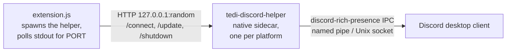

# TEDI Discord Rich Presence

Publishes your current [TEDI](https://github.com/IlhamriSKY/TEDI) workspace as a
Discord Rich Presence status: your friends see the folder you're working in, how
many workspaces and terminals you have open, and an icon for the focused tab
(terminal, SSH, editor, diff, preview, plus a language icon when editing).

<p align="center">
  
</p>

> [!NOTE]
> The bundled sidecar binary is unsigned. The first launch on each platform may
> show SmartScreen (Windows), Gatekeeper (macOS), or nothing (Linux). See
> [Trust prompts](#trust-prompts).

---

## Install

1. Open **Settings → Extensions** in TEDI.
2. Switch to the **From GitHub** tab.
3. Paste `IlhamriSKY/TEDI.discord-rich-presence` and click **Review → Install**.

Flip the card's **Switch** to start broadcasting. Toggle it off to stop.

## Update

In **Settings → Extensions**, click **Check updates** on this extension's
card. If a new release exists, click **Update** to reinstall in place.

## How it works



On Switch-on the extension:

1. Picks the right helper from `sidecar/<platform>-<arch>/`.
2. Spawns it via `shell_bg_spawn_direct`, then reads `PORT=<n>` from stdout.
3. POSTs `/connect`, then `/update` on every workspace change (workspace folder,
   workspace + terminal counts, active file, tab kind).

The helper exits in three independent ways: `/shutdown` on Switch-off or
extension uninstall, a parent-PID watchdog if TEDI crashes, or a 4 h idle
timeout as a final backstop.

The Rich Presence card the helper sends to Discord:

| Field | Source |
| --- | --- |
| Details | `<workspace folder>` (or `Idle` when no workspace is open). |
| State | `<N> workspace[s], <M> terminal[s]` (omits parts that are zero, blank when both are zero). |
| Started | First successful connect, shows elapsed-since-launch. |
| Large art | TEDI logo. |
| Small art | Tab-kind icon (terminal / SSH / editor / diff / preview / language). Hover text names the active file when editing. |
| Button | "Visit TEDI", tedi.ilhamriski.com. |

## Permissions

| Permission | Why |
| --- | --- |
| `ui:toast` | Surface failure modes (no helper for this platform, helper crashed, etc). |
| `statusbar:write` | Discord icon in the status bar (dim while connecting, full colour when connected). |
| `invoke:shell_bg_spawn_direct` | Start the sidecar as a long-running background process. |
| `invoke:shell_bg_logs` | Read the helper's stdout to discover the auto-assigned port. |
| `invoke:shell_bg_kill` | Stop the helper on disable / uninstall. |

No filesystem, keychain, or outbound network: every `fetch()` targets
`127.0.0.1:<helperPort>`.

## Trust prompts

| Platform | First launch | How to clear |
| --- | --- | --- |
| Windows | SmartScreen ("Windows protected your PC"). | Click **More info → Run anyway** once. |
| macOS | Gatekeeper may flag the helper as quarantined. | `xattr -dr com.apple.quarantine ~/Library/Application\ Support/id.ilhamrisky.tedi/extensions/tedi.discord-rich-presence/sidecar` |
| Linux | Nothing. TEDI's installer `chmod 0755`s `sidecar/` after extraction. | n/a |

## Development

```bash
git clone https://github.com/IlhamriSKY/TEDI.discord-rich-presence.git
cd TEDI.discord-rich-presence

# Build the native sidecar for your host.
cd sidecar-src
cargo build --release
mkdir -p ../sidecar/<platform>-<arch>      # e.g. linux-x86_64
cp target/release/tedi-discord-helper* ../sidecar/<platform>-<arch>/
cd ..

# Build extension.js from src/ (generated by esbuild, not committed).
npm install
npm run build

# Package, then install via Settings → Extensions → From file:
zip -r dev.zip manifest.json extension.js logo.png README.md CHANGELOG.md LICENSE sidecar
```

To cut a release, tag `vX.Y.Z` and push. CI in
[`.github/workflows/release.yml`](.github/workflows/release.yml) builds the
sidecar for every supported platform and uploads the zip to the GitHub release.
